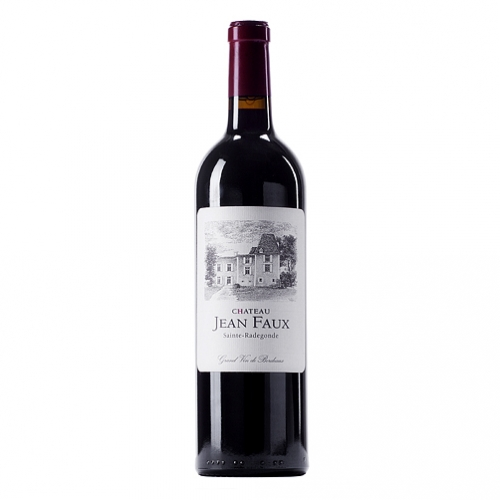

1. Установка background-image: 
получилось только через style в самом файле index
<header style="background-image: url(img/bordoRegion.png);">
Когда пыталась в  файле style.css: 
header {
    
    width: 100%;
    height: 200px;
    background-image: url(img/bordoRegion.png);
    background-color: lavender;
не отображает

2. Подпись под картинкой:
внутри элемента марикрованного списка пыталась добавить изображение с помощью 
<figure>
 
 <figcaption>Bordeaux Supérieur Rouge 2014, 31.69€</figcaption>
</figure>
(в стиле wineimage - 
.wineimage {
    float: right;
    height: 250px;
    width: 250px;
})
добавляла разные стили в подпись, теги html - все равно: изображение справа, подпись слева

3. Стоило ли здесь вообще использовать тег article?   Может быть section?

4. <!--  --> - это комментирование в html.  
а для css это /*  */?  

5. это уже не серьезный вопрос) у меня там есть ссылка на сайты, где продается вино, и рядом подпись с ценой, Можно как-то сделать именно ссылку на цену на определенном сайте, чтобы когда менялась цена у них - у меня тоже менялось?

